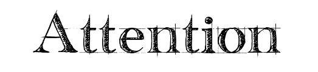

# Awesome-Attention-Mechanism-in-cv 

## Table of Contents

- [Introduction](#Introduction)
- [Attention Mechanism](#Attention-Mechanism)
- [Plug and Play Module](#Plug-and-Play-Module)
- [Vision Transformer](#Vision-Transformer)
- [Contributing](#Contributing)

## Introduction

This is a list of awesome attention mechanisms used in computer vision, as well as a collection of plug and play modules. Due to limited ability and energy, many modules may not be included. If you have any suggestions or improvements, welcome to submit an [issue](https://github.com/pprp/awesome-attention-mechanism-in-cv/issues) or [PR](https://github.com/pprp/awesome-attention-mechanism-in-cv/pulls).

## Attention Mechanism

| Paper                                                        | Publish     | Link                                                         | Blog                                            |
| ------------------------------------------------------------ | ----------- | ------------------------------------------------------------ | ----------------------------------------------- |
| [Squeeze and Excitation Network](https://arxiv.org/abs/1709.01507) | CVPR18      | [SENet](https://github.com/hujie-frank/SENet)                | [zhihu](https://zhuanlan.zhihu.com/p/102035721) |
| [Global Second-order Pooling Convolutional Networks](https://cs.jhu.edu/~alanlab/Pubs20/li2020neural.pdf) | CVPR19      | [GSoPNet](https://github.com/ZilinGao/Global-Second-order-Pooling-Convolutional-Networks) |                                                 |
| [Neural Architecture Search for Lightweight Non-Local Networks](https://cs.jhu.edu/~alanlab/Pubs20/li2020neural.pdf) | CVPR20      | [AutoNL](https://github.com/LiYingwei/AutoNL)                |                                                 |
| [Selective Kernel Network](https://arxiv.org/pdf/1903.06586.pdf) | CVPR19      | [SKNet](https://github.com/implus/SKNet)                     | [zhihu](https://zhuanlan.zhihu.com/p/102034839) |
| [Convolutional Block Attention Module](https://arxiv.org/pdf/1807.06521.pdf) | ECCV18      | [CBAM](https://github.com/Jongchan/attention-module)         | [zhihu](https://zhuanlan.zhihu.com/p/102035273) |
| [BottleNeck Attention Module](https://arxiv.org/pdf/1807.06514.pdf) | BMVC18      | [BAM](https://github.com/Jongchan/attention-module)          | [zhihu](https://zhuanlan.zhihu.com/p/102033063) |
| [Concurrent Spatial and Channel ‘Squeeze & Excitation’ in Fully Convolutional Networks](http://arxiv.org/pdf/1803.02579v2.pdf) | MICCAI18    | [scSE](https://github.com/ai-med/squeeze_and_excitation)     | [zhihu](https://zhuanlan.zhihu.com/p/102036086) |
| [Non-local Neural Networks](https://arxiv.org/abs/1711.07971) | CVPR19      | [Non-Local(NL)](https://github.com/AlexHex7/Non-local_pytorch) | [zhihu](https://zhuanlan.zhihu.com/p/102984842) |
| [GCNet: Non-local Networks Meet Squeeze-Excitation Networks and Beyond](https://arxiv.org/abs/1904.11492) | ICCVW19     | [GCNet](https://github.com/xvjiarui/GCNet)                   | [zhihu](https://zhuanlan.zhihu.com/p/102990363) |
| [CCNet: Criss-Cross Attention for Semantic Segmentation](https://arxiv.org/abs/1811.11721) | ICCV19      | [CCNet](https://github.com/speedinghzl/CCNet)                |                                                 |
| [SA-Net:shuffle attention for deep convolutional neural networks](https://arxiv.org/pdf/2102.00240.pdf) | ICASSP 21   | [SANet](https://github.com/wofmanaf/SA-Net)                  | [zhihu](https://zhuanlan.zhihu.com/p/350912960) |
| [ECA-Net: Efficient Channel Attention for Deep Convolutional Neural Networks](https://arxiv.org/pdf/1910.03151.pdf) | CVPR20      | [ECANet](https://github.com/BangguWu/ECANet)                 |                                                 |
| [Spatial Group-wise Enhance: Improving Semantic Feature Learning in Convolutional Networks](https://arxiv.org/abs/1905.09646) | CoRR19      | [SGENet](https://github.com/implus/PytorchInsight)           |                                                 |
| [FcaNet: Frequency Channel Attention Networks](https://arxiv.org/pdf/2012.11879.pdf) | ICCV21      | [FcaNet](https://github.com/cfzd/FcaNet)                     |                                                 |
| [$A^2\text{-}Nets$: Double Attention Networks](https://arxiv.org/abs/1810.11579) | NeurIPS18   | [DANet](https://github.com/nguyenvo09/Double-Attention-Network) |                                                 |
| [Asymmetric Non-local Neural Networks for Semantic Segmentation](https://arxiv.org/pdf/1908.07678.pdf) | ICCV19      | [APNB](https://github.com/MendelXu/ANN)                      |                                                 |
| [Efficient Attention: Attention with Linear Complexities](https://arxiv.org/pdf/1812.01243v7.pdf) | CoRR18      | [EfficientAttention](https://github.com/cmsflash/efficient-attention) |                                                 |
| [Image Restoration via Residual Non-local Attention Networks](https://arxiv.org/pdf/1903.10082.pdf) | ICLR19      | [RNAN](https://github.com/yulunzhang/RNAN)                   |                                                 |
| [Exploring Self-attention for Image Recognition](http://vladlen.info/papers/self-attention.pdf) | CVPR20      | [SAN](https://github.com/hszhao/SAN)                         |                                                 |
| [An Empirical Study of Spatial Attention Mechanisms in Deep Networks](https://arxiv.org/pdf/1904.05873.pdf) | ICCV19      | None                                                         |                                                 |
| [Object-Contextual Representations for Semantic Segmentation](https://arxiv.org/pdf/1909.11065.pdf) | ECCV20      | [OCRNet](https://github.com/HRNet/HRNet-Semantic-Segmentation/tree/HRNet-OCR?v=2) |                                                 |
| [IAUnet: Global text-Aware Feature Learning for Person Re-Identification](https://arxiv.org/pdf/2009.01035.pdf) | TTNNLS20    | [IAUNet](https://github.com/blue-blue272/ImgReID-IAnet)      |                                                 |
| [ResNeSt: Split-Attention Networks](https://arxiv.org/pdf/2004.08955.pdf) | CoRR20      | [ResNeSt](https://github.com/zhanghang1989/ResNeSt)          |                                                 |
| [Gather-Excite: Exploiting Feature Context in Convolutional Neural Networks](https://papers.nips.cc/paper/8151-gather-excite-exploiting-feature-context-in-convolutional-neural-networks.pdf) | NeurIPS18   | [GENet](https://github.com/hujie-frank/GENet)                |                                                 |
| [Improving Convolutional Networks with Self-calibrated Convolutions](http://mftp.mmcheng.net/Papers/20cvprSCNet.pdf) | CVPR20      | [SCNet](https://github.com/MCG-NKU/SCNet)                    |                                                 |
| [Rotate to Attend: Convolutional Triplet Attention Module](https://arxiv.org/pdf/2010.03045.pdf) | WACV21      | [TripletAttention](https://github.com/LandskapeAI/triplet-attention) |                                                 |
| [Dual Attention Network for Scene Segmentation](https://arxiv.org/pdf/1809.02983.pdf) | CVPR19      | [DANet](https://github.com/junfu1115/DANet)                  |                                                 |
| [Relation-Aware Global Attention for Person Re-identification](https://arxiv.org/pdf/1904.02998v1.pdf) | CVPR20      | [RGANet](https://github.com/microsoft/Relation-Aware-Global-Attention-Networks) |                                                 |
| [Attentional Feature Fusion](https://arxiv.org/abs/2009.14082) | WACV21      | [AFF](https://github.com/YimianDai/open-aff)                 |                                                 |
| [An Attentive Survey of Attention Models](https://arxiv.org/abs/1904.02874) | CoRR19      | None                                                         |                                                 |
| [Stand-Alone Self-Attention in Vision Models](https://arxiv.org/pdf/1906.05909.pdf) | NeurIPS19   | [FullAttention](https://github.com/leaderj1001/Stand-Alone-Self-Attention) |                                                 |
| [BiSeNet: Bilateral Segmentation Network for Real-time Semantic Segmentation](https://arxiv.org/abs/1808.00897) | ECCV18      | [BiSeNet](https://github.com/CoinCheung/BiSeNet)             | [zhihu](https://zhuanlan.zhihu.com/p/105925132) |
| [DCANet: Learning Connected Attentions for Convolutional Neural Networks](https://arxiv.org/pdf/2007.05099.pdf) | CoRR20      | [DCANet](https://github.com/13952522076/DCANet)              |                                                 |
| [An Empirical Study of Spatial Attention Mechanisms in Deep Networks](https://arxiv.org/abs/1904.05873) | ICCV19      | None                                                         |                                                 |
| [Look closer to see better: Recurrent attention convolutional neural network for fine-grained image recognition](https://openaccess.thecvf.com/content_cvpr_2017/papers/Fu_Look_Closer_to_CVPR_2017_paper.pdf) | CVPR17 Oral | [RA-CNN](https://github.com/Jianlong-Fu/Recurrent-Attention-CNN) |                                                 |
| [Guided Attention Network for Object Detection and Counting on Drones](https://arxiv.org/abs/1909.11307v1) | ACM MM20    | [GANet](https://isrc.iscas.ac.cn/gitlab/research/ganet)      |                                                 |
| [Attention Augmented Convolutional Networks](https://arxiv.org/abs/1904.09925) | ICCV19      | [AANet](https://github.com/leaderj1001/Attention-Augmented-Conv2d) |                                                 |
| [GLOBAL SELF-ATTENTION NETWORKS FOR IMAGE RECOGNITION](https://arxiv.org/pdf/2010.03019.pdf) | ICLR21      | [GSA](https://github.com/lucidrains/global-self-attention-network) |                                                 |
| [Attention-Guided Hierarchical Structure Aggregation for Image Matting](https://ieeexplore.ieee.org/document/9156481) | CVPR20      | [HAttMatting](https://github.com/wukaoliu/CVPR2020-HAttMatting) |                                                 |
| [Weight Excitation: Built-in Attention Mechanisms in Convolutional Neural Networks](http://www.ecva.net/papers/eccv_2020/papers_ECCV/papers/123750086.pdf) | ECCV20      | None                                                         |                                                 |
| [Expectation-Maximization Attention Networks for Semantic Segmentation](https://arxiv.org/pdf/1907.13426.pdf) | ICCV19 Oral | [EMANet](https://github.com/XiaLiPKU/EMANet)                 |                                                 |
| [Dense-and-implicit attention network](https://arxiv.org/abs/1905.10671) | AAAI 20     | [DIANet](https://github.com/gbup-group/DIANet)               |                                                 |
| [Coordinate Attention for Efficient Mobile Network Design](https://arxiv.org/abs/2103.02907) | CVPR21      | [CoordAttention](https://github.com/Andrew-Qibin/CoordAttention) |                                                 |
| [Cross-channel Communication Networks](https://papers.nips.cc/paper/8411-cross-channel-communication-networks.pdf) | NeurlPS19   | [C3Net](https://github.com/jwyang/C3Net.pytorch)             |                                                 |
| [Gated Convolutional Networks with Hybrid Connectivity for Image Classification](https://arxiv.org/pdf/1908.09699.pdf) | AAAI20      | [HCGNet](https://github.com/winycg/HCGNet)                   |                                                 |
| [Weighted Channel Dropout for Regularization of Deep Convolutional Neural Network](http://home.ustc.edu.cn/~saihui/papers/aaai2019_weighted.pdf) | AAAI19      | None                                                         |                                                 |
| [BA^2M: A Batch Aware Attention Module for Image Classification](https://arxiv.org/pdf/2103.15099.pdf) | CVPR21      | None                                                         |                                                 |
| [EPSANet：An Efficient Pyramid Split Attention Block on Convolutional Neural Network](https://arxiv.org/abs/2105.14447) | CoRR21      | [EPSANet](https://github.com/murufeng/EPSANet)               |                                                 |
| [Stand-Alone Self-Attention in Vision Models](https://arxiv.org/pdf/1906.05909.pdf) | NeurlPS19   | [SASA](https://github.com/leaderj1001/Stand-Alone-Self-Attention) |                                                 |
| [ResT: An Efficient Transformer for Visual Recognition](https://arxiv.org/pdf/2105.13677.pdf) | CoRR21      | [ResT](https://github.com/wofmanaf/ResT)                     |                                                 |
| [Spanet: Spatial Pyramid Attention Network for Enhanced Image Recognition](https://ieeexplore.ieee.org/document/9102906) | ICME20      | [SPANet](https://github.com/13952522076/SPANet)              |                                                 |
| [Space-time Mixing Attention for Video Transformer](https://arxiv.org/pdf/2106.05968.pdf) | CoRR21      | None                                                         |                                                 |
| [DMSANet: Dual Multi Scale Attention Network](https://arxiv.org/abs/2106.08382) | CoRR21      | None                                                         |                                                 |
| [CompConv: A Compact Convolution Module for Efficient Feature Learning](https://arxiv.org/abs/2106.10486) | CoRR21      | None                                                         |                                                 |
| [VOLO: Vision Outlooker for Visual Recognition](https://arxiv.org/pdf/2106.13112.pdf) | CoRR21      | [VOLO](https://github.com/sail-sg/volo)                      |                                                 |
| [Interflow: Aggregating Multi-layer Featrue Mappings with Attention Mechanism](https://arxiv.org/abs/2106.14073) | CoRR21      | None                                                         |                                                 |
| [MUSE: Parallel Multi-Scale Attention for Sequence to Sequence Learning](https://arxiv.org/abs/1911.09483) | CoRR21      | None                                                         |                                                 |
| [Polarized Self-Attention: Towards High-quality Pixel-wise Regression](https://arxiv.org/pdf/2107.00782.pdf) | CoRR21      | [PSA](https://github.com/DeLightCMU/PSA)                     |                                                 |
| [CA-Net: Comprehensive Attention Convolutional Neural Networks for Explainable Medical Image Segmentation](https://arxiv.org/pdf/2009.10549v2.pdf) | TMI21       | [CA-Net](https://github.com/HiLab-git/CA-Net)                |                                                 |
| [BAM: A Lightweight and Efficient Balanced Attention Mechanism for Single Image Super Resolution](https://arxiv.org/ftp/arxiv/papers/2104/2104.07566.pdf) | CoRR21      | [BAM](https://github.com/dandingbudanding/BAM)               |                                                 |
| [Attention as Activation](https://arxiv.org/pdf/2007.07729v2.pdf) | CoRR21      | [ATAC](https://github.com/YimianDai/open-atac)               |                                                 |
| [Region-based Non-local Operation for Video Classification](https://arxiv.org/pdf/2007.09033v5.pdf) | CoRR21      | [RNL](https://github.com/guoxih/region-based-non-local-network) |                                                 |
| [MSAF: Multimodal Split Attention Fusion](https://arxiv.org/pdf/2012.07175v2.pdf) | CoRR21      | [MSAF](https://github.com/anita-hu/MSAF)                     |                                                 |
| [All-Attention Layer](https://arxiv.org/abs/1907.01470v1)    | CoRR19      | None                                                         |                                                 |
| [Compact Global Descriptor](https://arxiv.org/abs/1907.09665v10) | CoRR20      | [CGD](https://github.com/HolmesShuan/Compact-Global-Descriptor) |                                                 |
| [SimAM: A Simple, Parameter-Free Attention Module for Convolutional Neural Networks](https://ruyuanzhang.github.io/files/2107_ICML.pdf) | ICML21      | [SimAM](https://github.com/ZjjConan/SimAM)                   |                                                 |
| [Drop an Octave: Reducing Spatial Redundancy in Convolutional Neural Networks With Octave Convolution](https://export.arxiv.org/pdf/1904.05049) | ICCV19      | [OctConv](https://github.com/facebookresearch/OctConv)       |                                                 |
| [Contextual Transformer Networks for Visual Recognition](https://arxiv.org/abs/2107.12292) | ICCV21      | [CoTNet](https://github.com/JDAI-CV/CoTNet)                  |                                                 |
| [Residual Attention: A Simple but Effective Method for Multi-Label Recognition](https://arxiv.org/abs/2108.02456) | ICCV21      | CSRA                                                         |                                                 |
| [Self-supervised Equivariant Attention Mechanism for Weakly Supervised Semantic Segmentation](https://arxiv.org/pdf/2004.04581v1.pdf) | CVPR20      | [SEAM](https://github.com/YudeWang/SEAM)                     |                                                 |
| [An Attention Module for Convolutional Neural Networks](https://arxiv.org/abs/2108.08205) | ICCV2021    | AW-Conv                                                      |                                                 |
| [Attentive Normalization](https://arxiv.org/pdf/1908.01259.pdf) | Arxiv2020   | None                                                         |                                                 |
| [Person Re-identification via Attention Pyramid](https://arxiv.org/abs/2108.05340) | TIP21       | [APNet](https://github.com/CHENGY12/APNet)                   |                                                 |
| [Unifying Nonlocal Blocks for Neural Networks](https://arxiv.org/abs/2108.02451) | ICCV21      | [SNL](https://github.com/zh460045050/SNL_ICCV2021)           |                                                 |
| [Tiled Squeeze-and-Excite: Channel Attention With Local Spatial Context](https://openaccess.thecvf.com/content/ICCV2021W/NeurArch/papers/Vosco_Tiled_Squeeze-and-Excite_Channel_Attention_With_Local_Spatial_Context_ICCVW_2021_paper.pdf) | ICCVW21     | None                                                         |                                                 |
| [PP-NAS: Searching for Plug-and-Play Blocks on Convolutional Neural Network](https://openaccess.thecvf.com/content/ICCV2021W/NeurArch/papers/Shen_PP-NAS_Searching_for_Plug-and-Play_Blocks_on_Convolutional_Neural_Network_ICCVW_2021_paper.pdf) | ICCVW21     | [PP-NAS](https://github.com/sbl1996/PP-NAS)                  |                                                 |
| [Distilling Knowledge via Knowledge Review](https://arxiv.org/pdf/2104.09044.pdf) | CVPR21      | [ReviewKD](https://github.com/dvlab-research/ReviewKD)       |                                                 |
| [Dynamic Region-Aware Convolution](https://arxiv.org/pdf/2003.12243.pdf) | CVPR21      | None                                                         |                                                 |
| [Encoder Fusion Network With Co-Attention Embedding for Referring Image Segmentation](https://openaccess.thecvf.com/content/CVPR2021/papers/Feng_Encoder_Fusion_Network_With_Co-Attention_Embedding_for_Referring_Image_Segmentation_CVPR_2021_paper.pdf) | CVPR21      | None                                                         |                                                 |
| [Introvert: Human Trajectory Prediction via Conditional 3D Attention](https://openaccess.thecvf.com/content/CVPR2021/papers/Shafiee_Introvert_Human_Trajectory_Prediction_via_Conditional_3D_Attention_CVPR_2021_paper.pdf) | CVPR21      | None                                                         |                                                 |
| [SSAN: Separable Self-Attention Network for Video Representation Learning](https://openaccess.thecvf.com/content/CVPR2021/papers/Guo_SSAN_Separable_Self-Attention_Network_for_Video_Representation_Learning_CVPR_2021_paper.pdf) | CVPR21      | None                                                         |                                                 |
| [Delving Deep into Many-to-many Attention for Few-shot Video Object Segmentation](https://openaccess.thecvf.com/content/CVPR2021/papers/Chen_Delving_Deep_Into_Many-to-Many_Attention_for_Few-Shot_Video_Object_Segmentation_CVPR_2021_paper.pdf) | CVPR21      | [DANet]( https://github.com/scutpaul/DANet)                  |                                                 |
| [A2 -FPN: Attention Aggregation based Feature Pyramid Network for Instance Segmentation](https://openaccess.thecvf.com/content/CVPR2021/papers/Hu_A2-FPN_Attention_Aggregation_Based_Feature_Pyramid_Network_for_Instance_Segmentation_CVPR_2021_paper.pdf) | CVPR21      | None                                                         |                                                 |
| [Image Super-Resolution with Non-Local Sparse Attention](https://openaccess.thecvf.com/content/CVPR2021/papers/Mei_Image_Super-Resolution_With_Non-Local_Sparse_Attention_CVPR_2021_paper.pdf) | CVPR21      | None                                                         |                                                 |
| [Keep your Eyes on the Lane: Real-time Attention-guided Lane Detection](https://openaccess.thecvf.com/content/CVPR2021/papers/Tabelini_Keep_Your_Eyes_on_the_Lane_Real-Time_Attention-Guided_Lane_Detection_CVPR_2021_paper.pdf) | CVPR21      | [LaneATT](https://github.com/lucastabelini/LaneATT)          |                                                 |
| [NAM: Normalization-based Attention Module](https://arxiv.org/abs/2111.12419) | CoRR21      | [NAM](https://github.com/Christian-lyc/NAM)                  |                                                 |
| [NAS-SCAM: Neural Architecture Search-Based Spatial and Channel Joint Attention Module for Nuclei Semantic Segmentation and Classification](https://link.springer.com/chapter/10.1007%2F978-3-030-59710-8_26) | MICCAI20    | [NAS-SCAM](https://github.com/ZuhaoLiu/NAS-SCAM)             |                                                 |
| [NASABN: A Neural Architecture Search Framework for Attention-Based Networks](http://vigir.missouri.edu/~gdesouza/Research/Conference_CDs/IEEE_WCCI_2020/IJCNN/Papers/N-20308.pdf) | IJCNN20     | None                                                         |                                                 |
| [Att-DARTS: Differentiable Neural Architecture Search for Attention](http://vigir.missouri.edu/~gdesouza/Research/Conference_CDs/IEEE_WCCI_2020/IJCNN/Papers/N-21042.pdf) | IJCNN20     | [Att-Darts](https://github.com/chomin/Att-DARTS)             |                                                 |
| [On the Integration of Self-Attention and Convolution](https://arxiv.org/pdf/2111.14556.pdf) | CoRR21      | [ACMix](https://gitee.com/mindspore/models)                  |                                                 |
| [BoxeR: Box-Attention for 2D and 3D Transformers](https://arxiv.org/pdf/2111.13087.pdf) | CoRR21      | None                                                         |                                                 |
| [CoAtNet: Marrying Convolution and Attention for All Data Sizes](https://proceedings.neurips.cc/paper/2021/file/20568692db622456cc42a2e853ca21f8-Paper.pdf) | NeurlPS21   | [coatnet](https://github.com/chinhsuanwu/coatnet-pytorch)    |                                                 |
| [Pay Attention to MLPs](https://proceedings.neurips.cc/paper/2021/file/4cc05b35c2f937c5bd9e7d41d3686fff-Paper.pdf) | NeurlPS21   | [gmlp](https://github.com/jaketae/g-mlp)                     |                                                 |
| [IC-Conv: Inception Convolution With Efficient Dilation Search](https://arxiv.org/pdf/2012.13587.pdf) | CVPR21 Oral | [IC-Conv](https://github.com/yifan123/IC-Conv)               |                                                 |
| [SRM : A Style-based Recalibration Module for Convolutional Neural Networks](https://openaccess.thecvf.com/content_ICCV_2019/papers/Lee_SRM_A_Style-Based_Recalibration_Module_for_Convolutional_Neural_Networks_ICCV_2019_paper.pdf) | ICCV19      | [SRM](https://github.com/hyunjaelee410/style-based-recalibration-module) |                                                 |
| [SPANet: Spatial Pyramid Attention Network for Enhanced Image Recognition](https://par.nsf.gov/servlets/purl/10206339) | ICME20      | [SPANet](https://github.com/13952522076/SPANet_TMM)          |                                                 |
| [Competitive Inner-Imaging Squeeze and Excitation for Residual Network](https://arxiv.org/pdf/1807.08920v4.pdf) | CoRR18      | [Competitive-SENet](https://github.com/scut-aitcm/Competitive-Inner-Imaging-SENet) |                                                 |
| [ULSAM: Ultra-Lightweight Subspace Attention Module for Compact Convolutional Neural Networks](https://arxiv.org/pdf/2006.15102.pdf) | WACV20      | [ULSAM](https://github.com/Nandan91/ULSAM)                   |                                                 |
| [Augmenting Convolutional networks with attention-based aggregation](https://arxiv.org/pdf/2112.13692.pdf) | CoRR21      | None                                                         |                                                 |
| [Context-aware Attentional Pooling (CAP) for Fine-grained Visual Classification](https://arxiv.org/abs/2101.06635) | AAAI21      | [CAP](https://github.com/ArdhenduBehera/cap)                 |                                                 |
| [Instance Enhancement Batch Normalization: An Adaptive Regulator of Batch Noise](https://ojs.aaai.org/index.php/AAAI/article/download/5917/5773) | AAAI20      | [IEBN](https://github.com/gbup-group/IEBN)                   |                                                 |
| [ASR: Attention-alike Structural Re-parameterization](https://arxiv.org/pdf/2304.06345.pdf) | CoRR23      | None                                                         |                                                 |

## Dynamic Networks

| Title                                                        | Publish   | Github                                                       |
| ------------------------------------------------------------ | --------- | ------------------------------------------------------------ |
| [Dynamic Neural Networks: A Survey](https://arxiv.org/abs/2102.04906v4) | CoRR21    | None                                                         |
| [CondConv: Conditionally Parameterized Convolutions for Efficient Inference](https://arxiv.org/abs/1904.04971) | NeurlPS19 | [CondConv](https://github.com/d-li14/condconv.pytorch)       |
| [DyNet: Dynamic Convolution for Accelerating Convolutional Neural Networks](https://arxiv.org/abs/2004.10694) | CoRR20    | None                                                         |
| [Dynamic Convolution: Attention over Convolution Kernels](https://arxiv.org/abs/1912.03458) | CVPR20    | [Dynamic-convolution-Pytorch](https://github.com/kaijieshi7/Dynamic-convolution-Pytorch) |
| [WeightNet: Revisiting the Design Space of Weight Network](https://arxiv.org/pdf/2007.11823.pdf) | ECCV20    | [weightNet](https://github.com/megvii-model/WeightNet)       |
| [Dynamic Filter Networks](http://papers.nips.cc/paper/6578-dynamic-filter-networks.pdf) | NeurlPS20 | None                                                         |
| [Dynamic deep neural networks: Optimizing accuracy-efficiency trade-offs by selective execution](https://arxiv.org/pdf/1701.00299.pdf) | AAAI17    | None                                                         |
| [SkipNet: Learning Dynamic Routing in Convolutional Networks](https://arxiv.org/pdf/1711.09485.pdf) | ECCV18    | [SkipNet](https://github.com/ucbdrive/skipnet)               |
| [Pay Less Attention with Lightweight and Dynamic Convolutions](https://arxiv.org/pdf/1901.10430.pdf) | ICLR19    | [fairseq](https://github.com/facebookresearch/fairseq)       |
| [Unified Dynamic Convolutional Network for Super-Resolution with Variational Degradations](https://arxiv.org/pdf/2004.06965.pdf) | CVPR20    | None                                                         |
| [Dynamic Group Convolution for Accelerating Convolutional Neural Networks]() | ECCV20    | [dgc](https://github.com/zhuogege1943/dgc)                   |

## Plug and Play Module

| Title                                                        | Publish   | Github                                                       |
| ------------------------------------------------------------ | --------- | ------------------------------------------------------------ |
| [ACNet: Strengthening the Kernel Skeletons for Powerful CNN via Asymmetric Convolution Blocks](https://arxiv.org/abs/1908.03930) | ICCV19    | [ACNet](https://github.com/DingXiaoH/ACNet)                  |
| [DeepLab: Semantic Image Segmentation with Deep Convolutional Nets, Atrous Convolution, and Fully Connected CRFs](https://arxiv.org/pdf/1606.00915v2.pdf) | TPAMI18   | [ASPP](https://github.com/kazuto1011/deeplab-pytorch)        |
| [MixConv: Mixed Depthwise Convolutional Kernels](https://bmvc2019.org/wp-content/uploads/papers/0583-paper.pdf) | BMCV19    | [MixedConv](https://github.com/tensorflow/tpu/tree/master/models/official/mnasnet/mixnet) |
| [Pyramid Scene Parsing Network](https://arxiv.org/pdf/1612.01105.pdf) | CVPR17    | [PSP](https://github.com/hszhao/PSPNet)                      |
| [Receptive Field Block Net for Accurate and Fast Object Detection](https://www.ecva.net/papers/eccv_2018/papers_ECCV/papers/Songtao_Liu_Receptive_Field_Block_ECCV_2018_paper.pdf) | ECCV18    | [RFB](https://github.com/GOATmessi7/RFBNet)                  |
| [Strip Pooling: Rethinking Spatial Pooling for Scene Parsing](https://arxiv.org/pdf/2003.13328.pdf) | CVPR20    | [SPNet](https://github.com/Andrew-Qibin/SPNet)               |
| [SSH: Single Stage Headless Face Detector](https://arxiv.org/pdf/1708.03979.pdf) | ICCV17    | [SSH](https://github.com/mahyarnajibi/SSH)                   |
| [GhostNet: More Features from Cheap Operations](https://arxiv.org/pdf/1911.11907.pdf) | CVPR20    | [GhostNet]()                                                 |
| [SlimConv: Reducing Channel Redundancy in Convolutional Neural Networks by Weights Flipping](https://arxiv.org/abs/2003.07469) | TIP21     | [SlimConv](https://github.com/JiaxiongQ/SlimConv)            |
| [EfficientNet: Rethinking Model Scaling for Convolutional Neural Networks](https://arxiv.org/abs/1905.11946) | ICML19    | [EfficientNet](https://github.com/lukemelas/EfficientNet-PyTorch) |
| [CondConv: Conditionally Parameterized Convolutions for Efficient Inference](https://arxiv.org/abs/1904.04971) | NeurlPS19 | [CondConv](https://github.com/d-li14/condconv.pytorch)       |
| [PP-NAS: Searching for Plug-and-Play Blocks on Convolutional Neural Network](https://ieeexplore.ieee.org/document/9607527/) | ICCVW21   | [PPNAS](https://github.com/sbl1996/PP-NAS)                   |
| [Dynamic Convolution: Attention over Convolution Kernels](https://openaccess.thecvf.com/content_CVPR_2020/papers/Chen_Dynamic_Convolution_Attention_Over_Convolution_Kernels_CVPR_2020_paper.pdf) | CVPR20    | [DynamicConv](https://github.com/kaijieshi7/Dynamic-convolution-Pytorch) |
| [PSConv: Squeezing Feature Pyramid into One Compact Poly-Scale Convolutional Layer](https://arxiv.org/abs/2007.06191) | ECCV20    | [PSConv](https://github.com/d-li14/PSConv)                   |
| [DCANet: Dense Context-Aware Network for Semantic Segmentation](https://arxiv.org/pdf/2104.02533.pdf) | ECCV20    | [DCANet](https://github.com/13952522076/DCANet)              |
| [Enhancing feature fusion for human pose estimation](https://link.springer.com/article/10.1007/s00138-020-01104-2) | MVA20     | [SEB](https://github.com/tongjiangwei/FeatureFusion)         |
| [Object Contextual Representation for sematic segmentation](https://arxiv.org/abs/1909.11065) | ECCV2020  | [HRNet-OCR](https://github.com/HRNet/HRNet-Semantic-Segmentation/tree/HRNet-OCR?v=2) |
| [DO-Conv: Depthwise Over-parameterized Convolutional Layer](https://arxiv.org/abs/2006.12030) | CoRR20    | [DO-Conv](https://github.com/yangyanli/DO-Conv)              |
| [Pyramidal Convolution: Rethinking Convolutional Neural Networks for Visual Recognition](http://arxiv.org/abs/2006.11538) | CoRR20    | [PyConv](https://github.com/iduta/pyconv)                    |
| [ULSAM: Ultra-Lightweight Subspace Attention Module for Compact Convolutional Neural Networks](https://arxiv.org/pdf/2006.15102.pdf) | WACV20    | [ULSAM](https://github.com/Nandan91/ULSAM)                   |
| [Dynamic Group Convolution for Accelerating Convolutional Neural Networks](https://www.ecva.net/papers/eccv_2020/papers_ECCV/papers/123510137.pdf) | ECCV20    | [DGC](https://github.com/zhuogege1943/dgc)                   |

## Vision Transformer

An Image is Worth 16x16 Words: Transformers for Image Recognition at Scale, ICLR 2021, ViT

[[paper]](https://arxiv.org/abs/2010.11929) [[Github]](https://github.com/lucidrains/vit-pytorch)

| Title                                                        | Publish | Github                                                       |
| ------------------------------------------------------------ | ------- | ------------------------------------------------------------ |
| [Swin Transformer: Hierarchical Vision Transformer using Shifted Windows](https://arxiv.org/abs/2103.14030) | ICCV21  | [SwinT](https://github.com/microsoft/Swin-Transformer)       |
| [CPVT: Conditional Positional Encodings for Vision Transformer](https://arxiv.org/abs/2102.10882) | CoRR21  | [CPVT](https://github.com/Meituan-AutoML/CPVT)               |
| [GLiT: Neural Architecture Search for Global and Local Image Transformer](https://arxiv.org/pdf/2107.02960.pdf) | CoRR21  | [GLiT](https://github.com/bychen515/GLiT)                    |
| [ConViT: Improving Vision Transformers with Soft Convolutional Inductive Biases](https://arxiv.org/abs/2103.10697) | CoRR21  | [ConViT](https://github.com/facebookresearch/convit)         |
| [CeiT: Incorporating Convolution Designs into Visual Transformers](https://arxiv.org/abs/2103.11816) | CoRR21  | [CeiT](https://github.com/rishikksh20/CeiT-pytorch)          |
| [BoTNet: Bottleneck Transformers for Visual Recognition](https://openaccess.thecvf.com/content/CVPR2021/papers/Srinivas_Bottleneck_Transformers_for_Visual_Recognition_CVPR_2021_paper.pdf) | CVPR21  | [BoTNet](https://github.com/leaderj1001/BottleneckTransformers) |
| [CvT: Introducing Convolutions to Vision Transformers](https://openaccess.thecvf.com/content/ICCV2021/papers/Wu_CvT_Introducing_Convolutions_to_Vision_Transformers_ICCV_2021_paper.pdf) | ICCV21  | [CvT](https://github.com/microsoft/CvT)                      |
| [TransCNN: Transformer in Convolutional Neural Networks](https://arxiv.org/abs/2106.03180) | CoRR21  | [TransCNN](https://github.com/yun-liu/TransCNN)              |
| [ResT: An Efficient Transformer for Visual Recognition](https://arxiv.org/abs/2105.13677) | CoRR21  | [ResT](https://github.com/wofmanaf/ResT)                     |
| [CoaT: Co-Scale Conv-Attentional Image Transformers]()       | CoRR21  | [CoaT](https://github.com/mlpc-ucsd/CoaT)                    |
| [ConTNet: Why not use convolution and transformer at the same time?](https://arxiv.org/abs/2104.13497) | CoRR21  | [ConTNet](https://github.com/yan-hao-tian/ConTNet)           |
| [DynamicViT: Efficient Vision Transformers with Dynamic Token Sparsification](https://arxiv.org/abs/2106.02034) | NeurlPS21 | [DynamicViT](https://github.com/raoyongming/DynamicViT)      |
| [DVT: Not All Images are Worth 16x16 Words: Dynamic Transformers for Efficient Image Recognition](https://arxiv.org/abs/2105.15075) | NeurlPS21 | [DVT](https://github.com/blackfeather-wang/Dynamic-Vision-Transformer) |
| [CoAtNet: Marrying Convolution and Attention for All Data Sizes](https://arxiv.org/pdf/2106.04803.pdf) | CoRR21  | [CoAtNet](https://github.com/chinhsuanwu/coatnet-pytorch)    |
| [Early Convolutions Help Transformers See Better](https://openreview.net/pdf?id=Lpfh1Bpqfk) | CoRR21  | None                                                         |
| [Compact Transformers: Escaping the Big Data Paradigm with Compact Transformers](https://arxiv.org/abs/2104.05704) | CoRR21  | [CCT](https://github.com/SHI-Labs/Compact-Transformers)      |
| [MobileViT: Light-weight, General-purpose, and Mobile-friendly Vision Transformer](https://arxiv.org/abs/2110.02178?context=cs.LG) | CoRR21  | [MobileViT](https://github.com/chinhsuanwu/mobilevit-pytorch) |
| [LeViT: a Vision Transformer in ConvNet's Clothing for Faster Inference](https://arxiv.org/abs/2104.01136) | CoRR21  | [LeViT](https://github.com/facebookresearch/LeViT)           |
| [Shuffle Transformer: Rethinking Spatial Shuffle for Vision Transformer](https://arxiv.org/abs/2106.03650) | CoRR21  | [ShuffleTransformer](https://github.com/mulinmeng/Shuffle-Transformer) |
| [ViTAE: Vision Transformer Advanced by Exploring Intrinsic Inductive Bias](https://openreview.net/pdf?id=_RnHyIeu5Y5) | CoRR21  | [ViTAE](https://github.com/Annbless/ViTAE)                   |
| [LocalViT: Bringing Locality to Vision Transformers](https://arxiv.org/abs/2104.05707) | CoRR21  | [LocalViT](https://github.com/ofsoundof/LocalViT)            |
| [DeiT: Training data-efficient image transformers & distillation through attention](https://arxiv.org/abs/2012.12877) | ICML21  | [DeiT](https://github.com/facebookresearch/deit)             |
| [CaiT: Going deeper with Image Transformers](https://github.com/facebookresearch/deit/blob/main/README_cait.md) | ICCV21  | [CaiT](https://github.com/facebookresearch/deit)             |
| [Efficient Training of Visual Transformers with Small-Size Datasets](https://arxiv.org/abs/2106.03746) | NeurlPS21 | None |
| [Vision Transformer with Deformable Attention](https://arxiv.org/pdf/2201.00520.pdf) | CoRR22 | [DAT](https://github.com/LeapLabTHU/DAT) |
| [MaxViT: Multi-Axis Vision Transformer](https://arxiv.org/abs/2204.01697) | CoRR22 | None |
| [Conv2Former: A Simple Transformer-Style ConvNet for Visual Recognition](https://arxiv.org/abs/2211.11943) | CoRR22 | [Conv2Former](https://github.com/HVision-NKU/Conv2Former) |
| [Rethinking Mobile Block for Efficient Neural Models](https://arxiv.org/abs/2301.01146) | CoRR23 | [EMO](https://github.com/zhangzjn/EMO) |
| [Wave-ViT: Unifying Wavelet and Transformers for Visual Representation Learning]() | ECCV22 | [Wave-ViT](https://github.com/YehLi/ImageNetModel) |
| [Dual Vision Transformer]() | CoRR23 | [Dual-ViT](https://github.com/YehLi/ImageNetModel) |
| [CoTNet: Contextual transformer networks for visual recognition](Contextual transformer networks for visual recognition) | TPAMI22 | [CoTNet](https://github.com/YehLi/ImageNetModel) |
| [ConvNeXt V2: Co-designing and Scaling ConvNets with Masked Autoencoders](https://arxiv.org/abs/2301.00808) | CoRR23 | [ConvNeXt-V2](https://github.com/facebookresearch/ConvNeXt-V2) |
| [A Close Look at Spatial Modeling: From Attention to Convolution](https://arxiv.org/abs/2212.12552) | CoRR22 | [FCViT](https://github.com/ma-xu/FCViT) |
| [Scalable Diffusion Models with Transformers](https://arxiv.org/abs/2212.09748) | CVPR22 | [DiT](https://github.com/facebookresearch/DiT) |
| [Dynamic Grained Encoder for Vision Transformers](https://proceedings.neurips.cc//paper/2021/file/2d969e2cee8cfa07ce7ca0bb13c7a36d-Paper.pdf) | NeurlPS21 | [vtpack](https://github.com/StevenGrove/vtpack) |
| [Segment Anything](https://arxiv.org/abs/2304.02643) | CoRR23 | [SAM](https://segment-anything.com/) |
| [Improved robustness of vision transformers via prelayernorm in patch embedding](https://www.sciencedirect.com/science/article/abs/pii/S0031320323003606) | PR23 | None |

| Title                                                        | Publish | Github                                                       | Main Idea     |
| ------------------------------------------------------------ | ------- | ------------------------------------------------------------ | ------------- |
| [Swin Transformer: Hierarchical Vision Transformer using Shifted Windows](https://arxiv.org/abs/2103.14030) | ICCV21  | [SwinT](https://github.com/microsoft/Swin-Transformer)       |               |
| [CPVT: Conditional Positional Encodings for Vision Transformer](https://arxiv.org/abs/2102.10882) | CoRR21  | [CPVT](https://github.com/Meituan-AutoML/CPVT)               |               |
| [GLiT: Neural Architecture Search for Global and Local Image Transformer](https://arxiv.org/pdf/2107.02960.pdf) | CoRR21  | [GLiT](https://github.com/bychen515/GLiT)                    | NAS           |
| [ConViT: Improving Vision Transformers with Soft Convolutional Inductive Biases](https://arxiv.org/abs/2103.10697) | CoRR21  | [ConViT](https://github.com/facebookresearch/convit)         | GPSA          |
| [CeiT: Incorporating Convolution Designs into Visual Transformers](https://arxiv.org/abs/2103.11816) | CoRR21  | [CeiT](https://github.com/rishikksh20/CeiT-pytorch)          | LCA,LeFF      |
| [BoTNet: Bottleneck Transformers for Visual Recognition](https://openaccess.thecvf.com/content/CVPR2021/papers/Srinivas_Bottleneck_Transformers_for_Visual_Recognition_CVPR_2021_paper.pdf) | CVPR21  | [BoTNet](https://github.com/leaderj1001/BottleneckTransformers) | NonBlock-like |
| [CvT: Introducing Convolutions to Vision Transformers](https://openaccess.thecvf.com/content/ICCV2021/papers/Wu_CvT_Introducing_Convolutions_to_Vision_Transformers_ICCV_2021_paper.pdf) | ICCV21  | [CvT](https://github.com/microsoft/CvT)                      | projection    |
| [TransCNN: Transformer in Convolutional Neural Networks](https://arxiv.org/abs/2106.03180) | CoRR21  | [TransCNN](https://github.com/yun-liu/TransCNN)              |               |
| [ResT: An Efficient Transformer for Visual Recognition](https://arxiv.org/abs/2105.13677) | CoRR21  | [ResT](https://github.com/wofmanaf/ResT)                     |               |
| [CoaT: Co-Scale Conv-Attentional Image Transformers]()       | CoRR21  | [CoaT](https://github.com/mlpc-ucsd/CoaT)                    |               |
| [ConTNet: Why not use convolution and transformer at the same time?](https://arxiv.org/abs/2104.13497) | CoRR21  | [ConTNet](https://github.com/yan-hao-tian/ConTNet)           |               |
| [DynamicViT: Efficient Vision Transformers with Dynamic Token Sparsification](https://arxiv.org/abs/2106.02034) | NIPS21  | [DynamicViT](https://github.com/raoyongming/DynamicViT)      |               |
| [DVT: Not All Images are Worth 16x16 Words: Dynamic Transformers for Efficient Image Recognition](https://arxiv.org/abs/2105.15075) | NIPS21  | [DVT](https://github.com/blackfeather-wang/Dynamic-Vision-Transformer) |               |
| [CoAtNet: Marrying Convolution and Attention for All Data Sizes](https://arxiv.org/pdf/2106.04803.pdf) | CoRR21  | [CoAtNet](https://github.com/chinhsuanwu/coatnet-pytorch)    |           |
| [Early Convolutions Help Transformers See Better](https://openreview.net/pdf?id=Lpfh1Bpqfk) | CoRR21  | None                                                         |           |
| [Compact Transformers: Escaping the Big Data Paradigm with Compact Transformers](https://arxiv.org/abs/2104.05704) | CoRR21  | [CCT](https://github.com/SHI-Labs/Compact-Transformers)      |           |
| [MobileViT: Light-weight, General-purpose, and Mobile-friendly Vision Transformer](https://arxiv.org/abs/2110.02178?context=cs.LG) | CoRR21  | [MobileViT](https://github.com/chinhsuanwu/mobilevit-pytorch) |           |
| [LeViT: a Vision Transformer in ConvNet's Clothing for Faster Inference](https://arxiv.org/abs/2104.01136) | CoRR21  | [LeViT](https://github.com/facebookresearch/LeViT)           |           |
| [Shuffle Transformer: Rethinking Spatial Shuffle for Vision Transformer](https://arxiv.org/abs/2106.03650) | CoRR21  | [ShuffleTransformer](https://github.com/mulinmeng/Shuffle-Transformer) |           |
| [ViTAE: Vision Transformer Advanced by Exploring Intrinsic Inductive Bias](https://openreview.net/pdf?id=_RnHyIeu5Y5) | CoRR21  | [ViTAE](https://github.com/Annbless/ViTAE)                   |           |
| [LocalViT: Bringing Locality to Vision Transformers](https://arxiv.org/abs/2104.05707) | CoRR21  | [LocalViT](https://github.com/ofsoundof/LocalViT)            |           |
| [DeiT: Training data-efficient image transformers & distillation through attention](https://arxiv.org/abs/2012.12877) | ICML21  | [DeiT](https://github.com/facebookresearch/deit)             |           |
| [CaiT: Going deeper with Image Transformers](https://github.com/facebookresearch/deit/blob/main/README_cait.md) | ICCV21  | [CaiT](https://github.com/facebookresearch/deit)             |           |
| [Efficient Training of Visual Transformers with Small-Size Datasets](https://arxiv.org/abs/2106.03746) | NIPS21 | None | |
| [Vision Transformer with Deformable Attention](https://arxiv.org/pdf/2201.00520.pdf) | CoRR22 | [DAT](https://github.com/LeapLabTHU/DAT) | DeformConv+SA |
| [MaxViT: Multi-Axis Vision Transformer](https://arxiv.org/abs/2204.01697) | CoRR22 | None | dilated attention |
| [Conv2Former: A Simple Transformer-Style ConvNet for Visual Recognition](https://arxiv.org/abs/2211.11943) | CoRR22 | [Conv2Former](https://github.com/HVision-NKU/Conv2Former) |  |
| [Demystify Transformers & Convolutions in Modern Image Deep Networks](https://arxiv.org/pdf/2211.05781.pdf) | CoRR22 | [STM-Evaluation](https://github.com/OpenGVLab/STM-Evaluation) | dai jifeng! |

## Contributing

If you know of any awesome attention mechanism in computer vision resources, please add them in the PRs or issues.

Additional article papers and corresponding code links are welcome in the issue.

Thanks to [@dedekinds](https://github.com/dedekinds) for pointing out the problem in the DIANet description.
